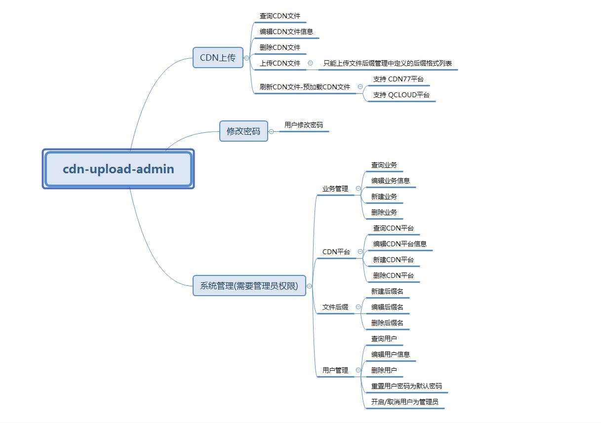
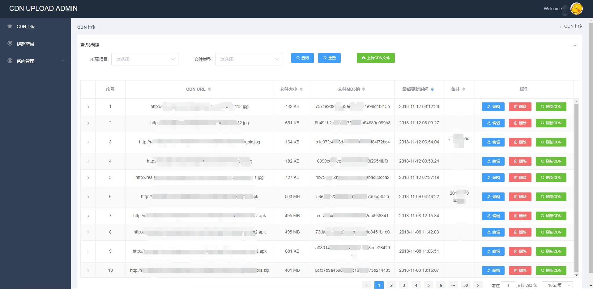
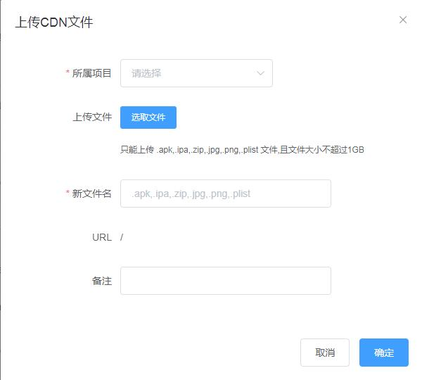
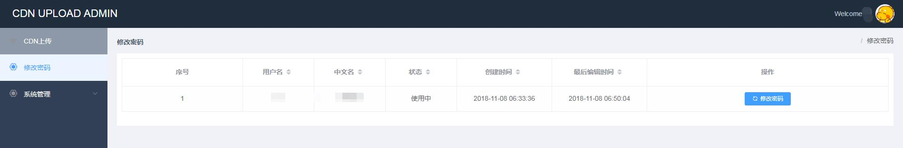
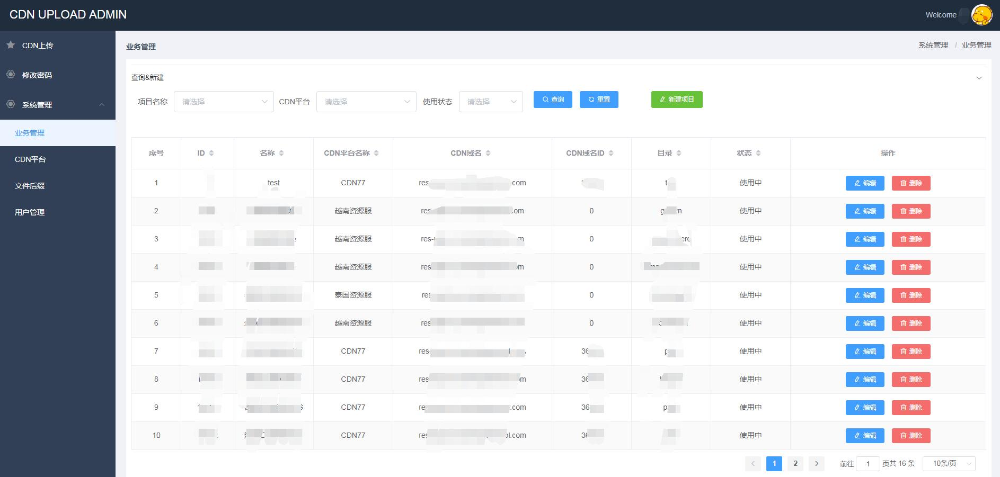
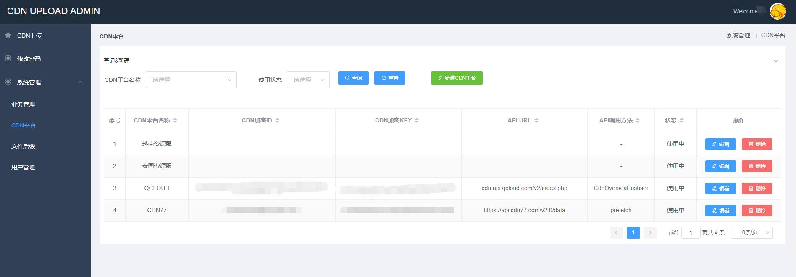
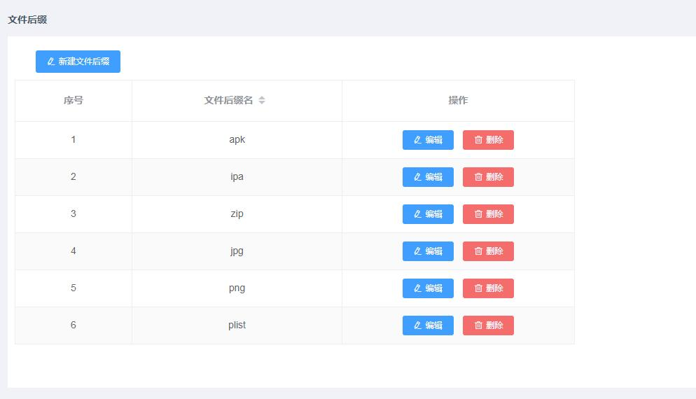
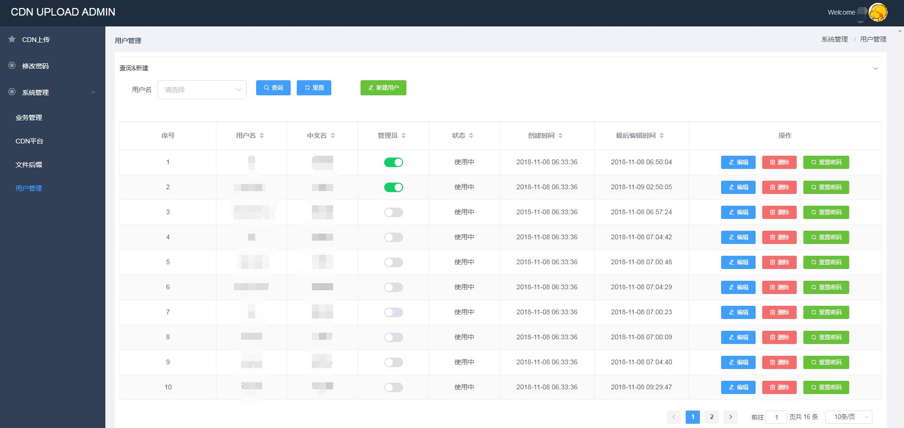

# **cdn-upload-admin**

## 一、开发目的
### 1、公司主要业务是做发行平台，项目比较多，不同的游戏项目根据发行地区不同可能使用当地IDC资源或者是云资源，运营同学会频繁上传各项目安装包文件或其他jpg/png等文件生成url方便用户或客户端包下载。
### 2、为了方便管理项目、IDC资源服LVS集群和CDN的文件等开发了此平台。
### 3、此平台部署在一台类似中心服务器上，服务器上安装了inotifywait工具并后台跑脚本会自动把上传后的文件用rsync同步到多个idc 资源服LVS集群中，另外此服务器也是配置为CDN的源站，CDN会从该服务器的站点拉取文件。

## 二、开发工具
### [前端为 vue + vuex + vue-router + axios + element-ui](./cdnadmin_webserver)
### [后端为 go, 纯api方式， 使用jwt做token认证](./cdnadmin_apiserver)

## 三、用xmind画的简单功能模块图

## 四、平台功能简图
### 1. CDN文件管理
#### 查询、编辑、删除、刷新CDN(IDC资源服不需要预加载，目前在后端是集成了CDN77和腾讯云海外CDN的刷新预加载接口)、上传文件

#### upload

### 2. 用户密码修改

### 3.系统管理
#### # 业务管理
##### 定义业务的名称、使用的CDN平台(具体的IDC资源服或其他CDN厂商)、域名、域名ID(此域名ID是当前使用的一家CDN厂商特有的，调用他们的API需要这个参数，其他不需要使用可使用为0)、存放文件的目录(子目录， 父目录是在后端cfg.json里的root_path定义了)

#### # CDN平台
##### 定义CDN厂商的API地址、SecretID、 SecretKey 和调用方法(由于单文件基本上都是几百M的大文件，所以只配置了文件预加载的方法)， IDC资源服只需要配置名称。

#### # 文件后缀
##### 定义限制上传的文件后缀

#### # 用户管理
##### 用户的增删查改、重置用户默认密码、 开启/禁用管理员， 只有管理员才能进行系统管理(此处只是在用户登陆时获取管理员角色后显示系统管理的路由，并没有非常细粒度的在后端进行用户权限验证)

